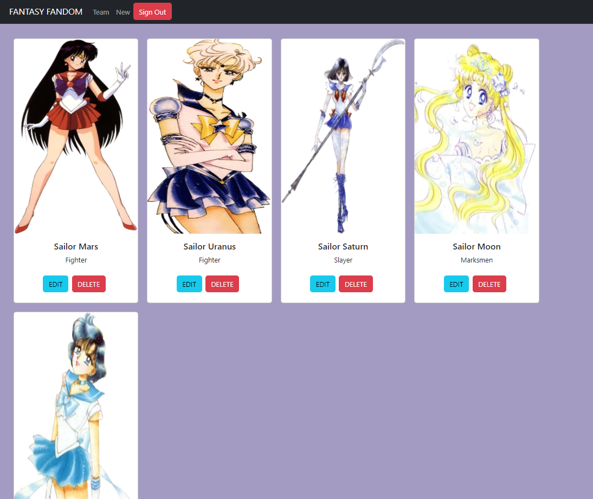

# FANTASY FANDOM
<!-- update the netlify badge above with your own badge that you can find at netlify under settings/general#status-badges -->

Just the app you need on your team! Fandom Fantasy let's you pick and choose the best fighters from across all fandoms.

## Get Started <!-- OPTIONAL, but doesn't hurt -->
First, clone this repo. Pick your favorite text editor. In your terminal, enter the following:

```
npm install
npm run dev
```
This will stand the live server. Authenticate with your email.

## About the User <!-- This is a scaled down user persona -->
- The best player is someone who knows their stuff! An anime fan with a niche for power-maxing and mixing and matching. Anyone who wants to fuse fandoms or see who synergizes with who!

## Features <!-- List your app features using bullets! Do NOT use a paragraph. No one will read that! -->
- A full CRUD application, created fully in React alongisde the Next JS feature. 
- Members can be added or removed. They can be given any role seen fit and edited as needed.

## LOOMS OF FANTASY FANDOM<!-- A loom link is sufficient -->
*Click below to see Fantasy Fandom in action!*
https://www.loom.com/share/618064478acd4c4ca449bfa9f3ab07ba?sid=350305e9-38e8-48de-a9a9-e1b465ff79c7

## PICTURES


## Contributors
- [Keana Cobarde](https://github.com/keanacobarde)
